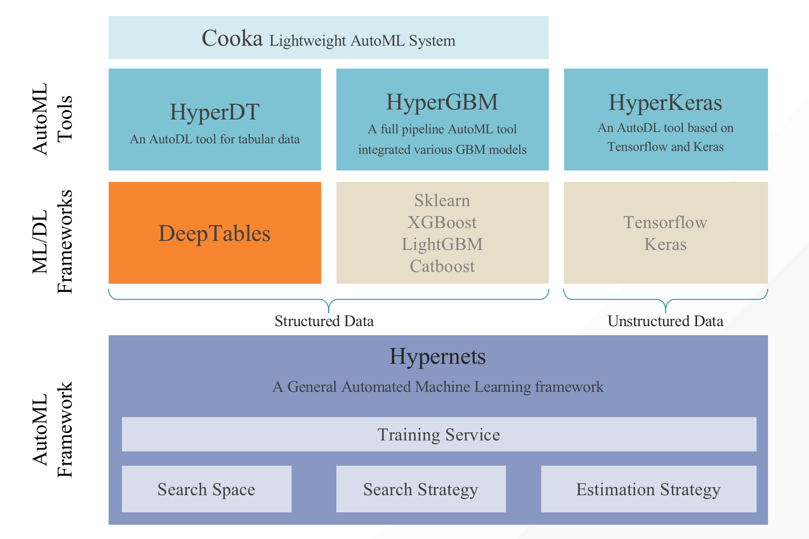

# HyperGBM
[](https://pypi.org/project/hypergbm)
[](https://pepy.tech/project/hypergbm)
[](https://pypi.org/project/hypergbm)

[中文](README_zh_CN.md)

## What is HyperGBM
HyperGBM is a library that supports full-pipeline AutoML, which completely covers the end-to-end stages of data cleaning, preprocessing, feature generation and selection, model selection and hyperparameter optimization.It is a real-AutoML tool for tabular data.

## Overview 

Unlike most AutoML approaches that focus on tackling the hyperparameter optimization problem of machine learning algorithms, HyperGBM can put the entire process from data cleaning to algorithm selection in one search space for optimization. End-to-end pipeline optimization is more like a sequential decision process, thereby HyperGBM uses reinforcement learning, Monte Carlo Tree Search, evolution algorithm combined with a meta-learner to efficiently solve such problems.

As the name implies, the ML algorithms used in HyperGBM are all GBM models, and more precisely the gradient boosting tree model, which currently includes XGBoost, LightGBM and Catboost.

The underlying search space representation and search algorithm in HyperGBM are powered by the [Hypernets](https://github.com/DataCanvasIO/Hypernets) project a general AutoML framework.


## Installation
```shell script
pip install hypergbm
```

## Hypernets related projects

* [HyperGBM](https://github.com/DataCanvasIO/HyperGBM): A full pipeline AutoML tool integrated various GBM models.
* [HyperDT/DeepTables](https://github.com/DataCanvasIO/DeepTables): An AutoDL tool for tabular data.
* [HyperKeras](https://github.com/DataCanvasIO/HyperKeras): An AutoDL tool for Neural Architecture Search and Hyperparameter Optimization on Tensorflow and Keras.
* [Cooka](https://github.com/DataCanvasIO/Cooka): Lightweight interactive AutoML system.
* [Hypernets](https://github.com/DataCanvasIO/Hypernets): A general automated machine learning framework.




## DataCanvas
HyperGBM is an open source project created by [DataCanvas](https://www.datacanvas.com/). 
