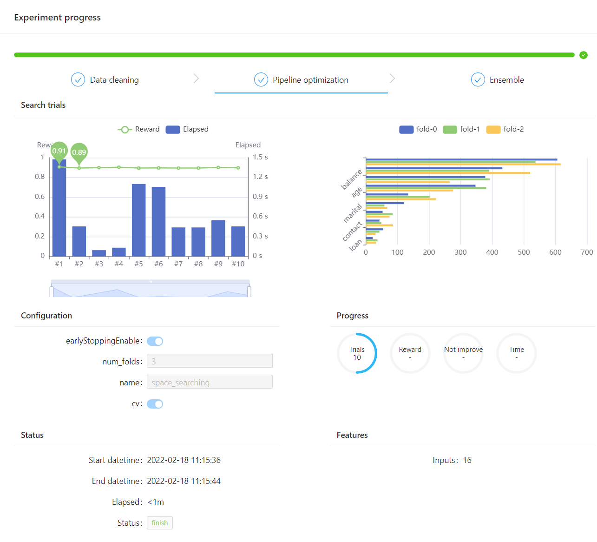

## Basic Applications

In this section, we are going to provide an example to show how to train a model using the tool `make_experiment`. In this example, we use the `blood` dataset, which is loaded from `hypernets.tabular`. The columns of this dataset can be shown as follows:
```text
Recency,Frequency,Monetary,Time,Class
2,50,12500,98,1
0,13,3250,28,1
1,16,4000,35,1
2,20,5000,45,1
1,24,6000,77,0
4,4,1000,4,0

...

```


### Create and Run an Experiment
Using the tool `make_experiment` can create an executable experiment object. The only required parameter of this tool is `train_data`. Then simply calling the method `run` of the created experiment object will start training and return a model. Note that if the target column of the data is not `y`, one needs to manually set it through the parameter `target`.

An example code:
```python
from hypergbm import make_experiment
from hypernets.tabular.datasets import dsutils

train_data = dsutils.load_blood()
experiment = make_experiment(train_data, target='Class')
estimator = experiment.run()
print(estimator)

```

output:
```
Pipeline(steps=[('data_clean',
                 DataCleanStep(...),
                ('estimator',
                 GreedyEnsemble(...)])

```
Training will return a Pipeline while the final returned model is a collection of multiple models.


For training data with file extension .csv or .parquet, the experiment can be created through using the data file path directly and `make_experiment` will load data as DataFrame automatically. For an example:

```python
from hypergbm import make_experiment

train_data = '/path/to/mydata.csv'
experiment = make_experiment(train_data, target='my_target')
estimator = experiment.run()
print(estimator)

```  


### Set the Number of Search Trials

One can set the max search trial number by adjusting `max_trials`. The following code sets the max searching time as 100:

```python
from hypergbm import make_experiment
from hypernets.tabular.datasets import dsutils

train_data = dsutils.load_blood()
experiment = make_experiment(train_data, target='Class', max_trials=100)
estimator = experiment.run()
print(estimator)

```

### Use Cross Validation

Users can apply cross validation in the experiment by manually setting parameter `cv`. Setting `cv=False` means the experiment will not apply cross validation but applying `train_test_split`. On the other hand, when `cv=True`, the experiment will apply cross validation. And the number of folds can be adjusted through the parameter `num_folds`, whose default value is 3.


Example code when `cv=True`:
```python
from hypergbm import make_experiment
from hypernets.tabular.datasets import dsutils

train_data = dsutils.load_blood()
experiment = make_experiment(train_data, target='Class', cv=True, num_folds=5)
estimator = experiment.run()
print(estimator)

```

### Evaluation dataset

When `cv=False`, the experiment object will additionally require evaluating its perfomance on the evaluation dataset. This can be done by setting `eval_data` when creating `make_experiment`. For example:

```python
from hypergbm import make_experiment
from hypernets.tabular.datasets import dsutils
from sklearn.model_selection import train_test_split

train_data = dsutils.load_blood()
train_data,eval_data=train_test_split(train_data,test_size=0.3)
experiment = make_experiment(train_data, target='Class', eval_data=eval_data, cv=False)
estimator = experiment.run()
print(estimator)

```

If the `eval_data` is not given, the experiment object will split the `train_data` to obtain an evaluation dataset, whose size can be adjusted by setting `eval_size`:

```python
from hypergbm import make_experiment
from hypernets.tabular.datasets import dsutils

train_data = dsutils.load_blood()

experiment = make_experiment(train_data, target='Class', cv=False, eval_size=0.2)
estimator = experiment.run()
print(estimator)

```


### Set the Evaluation Criterion

The default evaluation criterion of the experiment object for classification task is `accuracy`, while for regression task is `rmse`. Other criterions can be set through `reward_metric`. For example:

```python
from hypergbm import make_experiment
from hypernets.tabular.datasets import dsutils

train_data = dsutils.load_blood()
experiment = make_experiment(train_data, target='Class', reward_metric='auc')
estimator = experiment.run()
print(estimator)

```


### Set the Early Stopping

One can set the early stopping strategy with settings of `early_stopping_rounds`, `early_stopping_time_limit` and `early_stopping_reward`.

The following code sets the max searching time as 3 hours:
```python
from hypergbm import make_experiment
from hypernets.tabular.datasets import dsutils

train_data = dsutils.load_blood()

experiment = make_experiment(train_data, target='Class', max_trials=300, early_stopping_time_limit=3600 * 3)
estimator = experiment.run()
print(estimator)

```


### Choose a Searcher

HyperGBM performs hyperparameter search using the search algorithms provided by Hypernets, which includes EvolutionSearch, MCTSSearcher, and RandomSearcher. One can choose a specific searcher by setting the parameter `searcher` when using `make_experiment`.

```python
from hypergbm import make_experiment
from hypernets.tabular.datasets import dsutils

train_data = dsutils.load_blood()

experiment = make_experiment(train_data, target='Class', searcher='random')
estimator = experiment.run()
print(estimator)

```


Furthermore, you can make a new searcher object for experiment, for an example:

```python
from hypergbm import make_experiment
from hypergbm.search_space import search_space_general
from hypernets.searchers import MCTSSearcher
from hypernets.tabular.datasets import dsutils

my_searcher = MCTSSearcher(lambda: search_space_general(n_estimators=100),
                           max_node_space=20,
                           optimize_direction='max')

train_data = dsutils.load_blood()

experiment = make_experiment(train_data, target='Class', searcher=my_searcher)
estimator = experiment.run()
print(estimator)

```


### Ensemble Models

`make_experiment` automatically turns on the model ensemble function to achieve a better model. It will ensemble the best 20 models while the number for ensembling can be changed by setting `ensemble_size` as the following code, where `ensemble_size=0` means no ensembling wii be made.

```python
train_data = ...
experiment = make_experiment(train_data, ensemble_size=10, ...)

```


### Set Log Levels

The progress messages during training can be printed by setting `log_level` (`str` or `int`). Please refer the `logging` package of python for further details. Besides, more comprehensive messages will be printed when setting `verbose` as `1`.

The following codes sets the log level to 'INFO':
```python
from hypergbm import make_experiment
from hypernets.tabular.datasets import dsutils

train_data = dsutils.load_blood()
experiment = make_experiment(train_data, target='Class', log_level='INFO', verbose=1)
estimator = experiment.run()
print(estimator)

```

Output:
```console
14:24:33 I hypernets.tabular.u._common.py 30 - 2 class detected, {0, 1}, so inferred as a [binary classification] task
14:24:33 I hypergbm.experiment.py 699 - create experiment with ['data_clean', 'drift_detection', 'space_search', 'final_ensemble']
14:24:33 I hypergbm.experiment.py 1262 - make_experiment with train data:(748, 4), test data:None, eval data:None, target:Class
14:24:33 I hypergbm.experiment.py 716 - fit_transform data_clean
14:24:33 I hypergbm.experiment.py 716 - fit_transform drift_detection
14:24:33 I hypergbm.experiment.py 716 - fit_transform space_search
14:24:33 I hypernets.c.meta_learner.py 22 - Initialize Meta Learner: dataset_id:7123e0d8c8bbbac8797ed9e42352dc59
14:24:33 I hypernets.c.callbacks.py 192 - 
Trial No:1
--------------------------------------------------------------
(0) estimator_options.hp_or:                                0
(1) numeric_imputer_0.strategy:                 most_frequent
(2) numeric_scaler_optional_0.hp_opt:                    True


...

14:24:35 I hypergbm.experiment.py 716 - fit_transform final_ensemble
14:24:35 I hypergbm.experiment.py 737 - trained experiment pipeline: ['data_clean', 'estimator']
Pipeline(steps=[('data_clean',
                 DataCleanStep(...),
                ('estimator',
                 GreedyEnsemble(...)
```


### Experiment Visualization

HyperGBM supports user interface based on webpage by setting the argument `webui=True`, where you see all the processing and parameters information displayed in a dashboard. 

Note: This function requires to install hypergbm with the command:
```python
pip install hypergbm[board]
```

The example codes of enabling experiment visualization based on website is shown below:
```python
from sklearn.model_selection import train_test_split

from hypergbm import make_experiment
from hypernets.tabular.datasets import dsutils

df = dsutils.load_bank()
df_train, df_test = train_test_split(df, test_size=0.8, random_state=42)

experiment = make_experiment(df_train, target='y', webui=True)
estimator = experiment.run(max_trials=10)

print(estimator)
```

The output is:
```console
02-17 19:08:48 I hypernets.t.estimator_detector.py 85 - EstimatorDetector error: GPU Tree Learner was not enabled in this build.
Please recompile with CMake option -DUSE_GPU=1
...
server is running at: 0.0.0.0:8888 
...

02-17 19:08:55 I hypernets.t.metrics.py 153 - calc_score ['auc', 'accuracy'], task=binary, pos_label=yes, classes=['no' 'yes'], average=None
final result:{'auc': 0.8913467492260062, 'accuracy': 0.8910699474702792}
```

Then you could see the experiment progress dashboard by accessing the web server `http://localhost:8888`. One screenshot is displayed below:



It also support other options to configure the `webui`: defining the file directory by `event_file_dir`, setting the server port by `server_port`, and defining if exiting the web server after finishing the current experiment by `exit_web_server_on_finish`. See example:
```python
...
webui_options = {
    'event_file_dir': "./events",  # persist experiment running events log to './events'
    'server_port': 8888, # http server port
    'exit_web_server_on_finish': False  # exit http server after experiment finished
}
experiment = make_experiment(df_train, target='y', webui=True, webui_options=webui_options)
...
```


