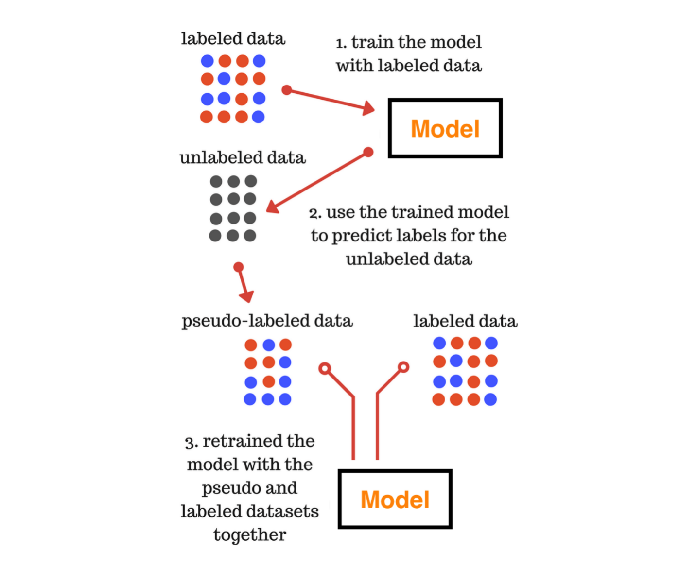

## Programing Guide

### Main components

In this section, we briefly cover the **main components** in HyperGBM.
As shown below:


* HyperGBM(HyperModel)

    HyperGBM is a specific implementation of HyperModel (for HyperModel, please refer to the [Hypernets](https://github.com/DataCanvasIO/Hypernets) project).
It is the core interface of the HyperGBM project. By calling the `search` method to explore and return the best model in the specified `Search Space` with the specified `Searcher`.


* Search Space

    Search spaces are constructed by arranging ModelSpace(transformer and estimator), ConnectionSpace(pipeline) and ParameterSpace(hyperparameter). The transformers are chained together by pipelines while the pipelines can be nested. The last node of a search space must be an estimator. Each transformer and estimator can define a set of hyperparameterss.


    The code example of Numeric Pipeline is as follows：
```python
import numpy as np
from hypergbm.pipeline import Pipeline
from hypergbm.sklearn.transformers import SimpleImputer, StandardScaler, MinMaxScaler, MaxAbsScaler, RobustScaler, LogStandardScaler
from hypernets.core.ops import ModuleChoice, Optional, Choice
from tabular_toolbox.column_selector import  column_number_exclude_timedelta


def numeric_pipeline_complex(impute_strategy=None, seq_no=0):
    if impute_strategy is None:
        impute_strategy = Choice(['mean', 'median', 'constant', 'most_frequent'])
    elif isinstance(impute_strategy, list):
        impute_strategy = Choice(impute_strategy)

    imputer = SimpleImputer(missing_values=np.nan, strategy=impute_strategy, name=f'numeric_imputer_{seq_no}',
                            force_output_as_float=True)
    scaler_options = ModuleChoice(
        [
            LogStandardScaler(name=f'numeric_log_standard_scaler_{seq_no}'),
            StandardScaler(name=f'numeric_standard_scaler_{seq_no}'),
            MinMaxScaler(name=f'numeric_minmax_scaler_{seq_no}'),
            MaxAbsScaler(name=f'numeric_maxabs_scaler_{seq_no}'),
            RobustScaler(name=f'numeric_robust_scaler_{seq_no}')
        ], name=f'numeric_or_scaler_{seq_no}'
    )
    scaler_optional = Optional(scaler_options, keep_link=True, name=f'numeric_scaler_optional_{seq_no}')
    pipeline = Pipeline([imputer, scaler_optional],
                        name=f'numeric_pipeline_complex_{seq_no}',
                        columns=column_number_exclude_timedelta)
    return pipeline
```
* Searcher

    Searcher is an algorithm used to explore a search space.It encompasses the classical exploration-exploitation trade-off since, on the one hand, it is desirable to find well-performing model quickly, while on the other hand, premature convergence to a region of suboptimal solutions should be avoided.
    Three algorithms are provided in HyperGBM: MCTSSearcher (Monte-Carlo tree search), EvolutionarySearcher and RandomSearcher.
    
* HyperGBMEstimator

    HyperGBMEstimator is an object built from a sample in the search space, including the full preprocessing pipeline and a GBM model. It can be used to `fit` on training data, `evaluate` on evaluation data, and `predict` on new data.

* CompeteExperiment

    `CompeteExperiment` is a powerful tool provided in HyperGBM. It not only performs pipeline search, but also contains some advanced features to further improve the model performance such as data drift handling, pseudo-labeling, ensemble, etc.

### Use cases

* Use case of HyperGBM
```python
# import HyperGBM, Search Space and Searcher
from hypergbm import HyperGBM
from hypergbm.search_space import search_space_general
from hypernets.searchers.random_searcher import RandomSearcher
import pandas as pd
from sklearn.model_selection import train_test_split

# instantiate related objects
searcher = RandomSearcher(search_space_general, optimize_direction='max')
hypergbm = HyperGBM(searcher, task='binary', reward_metric='accuracy')

# load data into Pandas DataFrame
df = pd.read_csv('[train_data_file]')
y = df.pop('target')

# split data into train set and eval set
# The evaluation set is used to evaluate the reward of the model fitted with the training set
X_train, X_eval, y_train, y_eval = train_test_split(df, y, test_size=0.3)

# search
hypergbm.search(X_train, y_train, X_eval, y_eval, max_trials=30)

# load best model
best_trial = hypergbm.get_best_trial()
estimator = hypergbm.load_estimator(best_trial.model_file)

# predict on real data
pred = estimator.predict(X_real)
```

* Use case of Experiment
```python
from hypergbm import make_experiment
import pandas as pd

# load data into Pandas DataFrame
df = pd.read_csv('[train_data_file]')
target = 'target'

#create an experiment
experiment = make_experiment(df, target=target)

#run experiment
estimator = experiment.run()

# predict on real data
pred = estimator.predict(X_real)
```


### HyperGBM

**Required Parameters**

- *searcher*: hypernets.searcher.Searcher, A Searcher instance.
    `hypernets.searchers.RandomSearcher`
    `hypernets.searcher.MCTSSearcher`
    `hypernets.searchers.EvolutionSearcher`

**Optinal Parameters**

- *dispatcher*: hypernets.core.Dispatcher, Dispatcher is used to provide different execution modes for search trials, such as in-process mode (`InProcessDispatcher`), distributed parallel mode (`DaskDispatcher`), etc. `InProcessDispatcher` is used by default.
- *callbacks*: list of callback functions or None, optional (default=None), List of callback functions that are applied at each trial. See `hypernets.callbacks` for more information.
- *reward_metric*: str or None, optinal(default=accuracy), Set corresponding metric  according to task type to guide search direction of searcher.
- *task*: str or None, optinal(default=None), Task type(*binary*,*multiclass* or *regression*). If None, inference the type of task automatically
- *param data_cleaner_params*: dict, (default=None), Dictionary of parameters to initialize the `DataCleaner` instance. If None, `DataCleaner` will initialized with default values.
- *param cache_dir*: str or None, (default=None), Path of data cache. If None, uses 'working directory/tmp/cache' as cache dir
- *param clear_cache*: bool, (default=True), Whether clear the cache dir before searching

#### search

**Required Parameters**

- *X*: Pandas or Dask DataFrame, feature data for training
- *y*: Pandas or Dask Series, target values for training
- *X_eval*: (Pandas or Dask DataFrame) or None, feature data for evaluation
- *y_eval*: (Pandas or Dask Series) or None, target values for evaluation

**Optinal Parameters**

- *cv*: bool, (default=False), If True, use cross-validation instead of evaluation set reward to guide the search process
- *num_folds*: int, (default=3), Number of cross-validated folds, only valid when cv is true
- *max_trials*: int, (default=10), The upper limit of the number of search trials, the search process stops when the number is exceeded
- **fit_kwargs: dict, parameters for fit method of model

### Searchers

#### MCTSSearcher: Monte-Carlo Tree Search
    
Monte-Carlo Tree Search (MCTS) extends the celebrated Multi-armed Bandit algorithm to tree-structured search spaces. The MCTS algorithm iterates over four phases: selection, expansion, playout and backpropagation.
    
* Selection: In each node of the tree, the child node is selected after a Multi-armed Bandit strategy, e.g. the UCT (Upper Confidence bound applied to Trees) algorithm.

* Expansion: The algorithm adds one or more nodes to the tree. This node corresponds to the first encountered position that was not added in the tree.

* Playout: When reaching the limits of the visited tree, a roll-out strategy is used to select the options until reaching a terminal node and computing the associated
reward.

* Backpropagation: The reward value is propagated back, i.e. it is used to update the value associated to all nodes along the visited path up to the root node.

**Code example**
```
from hypernets.searchers import MCTSSearcher

searcher = MCTSSearcher(search_space_fn, use_meta_learner=False, max_node_space=10, candidates_size=10, optimize_direction='max')
```

**Required Parameters**
- *space_fn*: callable, A search space function which when called returns a `HyperSpace` instance.

**Optinal Parameters**
- *policy*: hypernets.searchers.mcts_core.BasePolicy, (default=None), The policy for *Selection* and *Backpropagation* phases, `UCT` by default.
- *max_node_space*: int, (default=10), Maximum space for node expansion
- *use_meta_learner*: bool, (default=True), Meta-learner aims to evaluate the performance of unseen samples based on previously evaluated samples. It provides a practical solution to accurately estimate a search branch with many simulations without involving the actual training.
- *candidates_size*: int, (default=10), The number of samples for the meta-learner to evaluate candidate paths when roll out
- *optimize_direction*: 'min' or 'max', (default='min'), Whether the search process is approaching the maximum or minimum reward value.
- *space_sample_validation_fn*: callable or None, (default=None), Used to verify the validity of samples from the search space, and can be used to add specific constraint rules to the search space to reduce the size of the space.

#### EvolutionSearcher: Evolutionary Algorithm

Evolutionary algorithm (EA) is a subset of evolutionary computation, a generic population-based metaheuristic optimization algorithm. An EA uses mechanisms inspired by biological evolution, such as reproduction, mutation, recombination, and selection. Candidate solutions to the optimization problem play the role of individuals in a population, and the fitness function determines the quality of the solutions (see also loss function). Evolution of the population then takes place after the repeated application of the above operators.


**Code example**
```
from hypernets.searchers import EvolutionSearcher

searcher = EvolutionSearcher(search_space_fn, population_size=20, sample_size=5, optimize_direction='min')
```

**Required Parameters**
- *space_fn*: callable, A search space function which when called returns a `HyperSpace` instance
- *population_size*: int, Size of population
- *sample_size*: int, The number of parent candidates selected in each cycle of evolution

**Optinal Parameters**
- *regularized*: bool, (default=False), Whether to enable regularized
- *use_meta_learner*: bool, (default=True), Meta-learner aims to evaluate the performance of unseen samples based on previously evaluated samples. It provides a practical solution to accurately estimate a search branch with many simulations without involving the actual training.
- *candidates_size*: int, (default=10), The number of samples for the meta-learner to evaluate candidate paths when roll out
- *optimize_direction*: 'min' or 'max', (default='min'), Whether the search process is approaching the maximum or minimum reward value.
- *space_sample_validation_fn*: callable or None, (default=None), Used to verify the validity of samples from the search space, and can be used to add specific constraint rules to the search space to reduce the size of the space.


#### Random Search

As its name suggests, Random Search uses random combinations of hyperparameters.
**Code example**
```
from hypernets.searchers import RandomSearcher

searcher = RandomSearcher(search_space_fn, optimize_direction='min')
```

**Required Parameters**
- *space_fn*: callable, A search space function which when called returns a `HyperSpace` instance

**Optinal Parameters**
- *optimize_direction*: 'min' or 'max', (default='min'), Whether the search process is approaching the maximum or minimum reward value.
- *space_sample_validation_fn*: callable or None, (default=None), Used to verify the validity of samples from the search space, and can be used to add specific constraint rules to the search space to reduce the size of the space.


### Search Space
#### Build-in Search Space
**Code example**
```
from hypergbm.search_space import search_space_general

searcher = RandomSearcher(search_space_general, optimize_direction='min')
# or 
searcher = RandomSearcher(lambda: search_space_general(n_estimators=300, early_stopping_rounds=10, verbose=0), optimize_direction='min')
```

#### Custom Search Space
**Code example**
```
```

### CompeteExperiment
There are still many challenges in the machine learning modeling process for tabular data, such as imbalanced data, data drift, poor generalization ability, etc.  This challenges cannot be completely solved by pipeline search, so we introduced in HyperGBM a more powerful tool is `CompeteExperiment`.

`CompteExperiment` is composed of a series of steps and *Pipeline Search* is just one step. It also includes advanced steps such as data cleaning, data drift handling, two-stage search, ensemble etc., as shown in the figure below:


**Code example**
```python
from hypergbm import make_experiment
from hypergbm.search_space import search_space_general
import pandas as pd
import logging

# load data into Pandas DataFrame
df = pd.read_csv('[train_data_file]')
target = 'target'

#create an experiment
experiment = make_experiment(df, target=target, 
                 search_space=lambda: search_space_general(class_balancing='SMOTE',n_estimators=300, early_stopping_rounds=10, verbose=0),
                 collinearity_detection=False,
                 drift_detection=True,
                 feature_reselection=False,
                 feature_reselection_estimator_size=10,
                 feature_reselection_threshold=1e-5,
                 ensemble_size=20,
                 pseudo_labeling=False,
                 pseudo_labeling_proba_threshold=0.8,
                 pseudo_labeling_resplit=False,
                 retrain_on_wholedata=False,
                 log_level=logging.ERROR,)

#run experiment
estimator = experiment.run()

# predict on real data
pred = estimator.predict(X_real)
```

**Required Parameters**
- *hyper_model*: hypergbm.HyperGBM, A `HyperGBM` instance
- *X_train*: Pandas or Dask DataFrame, Feature data for training
- *y_train*: Pandas or Dask Series, Target values for training


**Optinal Parameters**
- *X_eval*: (Pandas or Dask DataFrame) or None, (default=None), Feature data for evaluation
- *y_eval*: (Pandas or Dask Series) or None, (default=None), Target values for evaluation
- *X_test*: (Pandas or Dask Series) or None, (default=None), Unseen data without target values for semi-supervised learning
- *eval_size*: float or int, (default=None), Only valid when ``X_eval`` or ``y_eval`` is None. If float, should be between 0.0 and 1.0 and represent the proportion of the dataset to include in the eval split. If int, represents the absolute number of test samples. If None, the value is set to the complement of the train size. 
- *train_test_split_strategy*: *'adversarial_validation'* or None, (default=None), Only valid when ``X_eval`` or ``y_eval`` is None. If None, use eval_size to split the dataset, otherwise use adversarial validation approach.
- *cv*: bool, (default=False), If True, use cross-validation instead of evaluation set reward to guide the search process
- *num_folds*: int, (default=3), Number of cross-validated folds, only valid when cv is true
- *task*: str or None, optinal(default=None), Task type(*binary*, *multiclass* or *regression*). If None, inference the type of task automatically
- *callbacks*: list of callback functions or None, (default=None), List of callback functions that are applied at each experiment step. See `hypernets.experiment.ExperimentCallback` for more information.
- *random_state*: int or RandomState instance, (default=9527), Controls the shuffling applied to the data before applying the split.
- *scorer*: str, callable or None, (default=None), Scorer to used for feature importance evaluation and ensemble. It can be a single string (see [get_scorer](https://scikit-learn.org/stable/modules/generated/sklearn.metrics.get_scorer.html)) or a callable (see [make_scorer](https://scikit-learn.org/stable/modules/generated/sklearn.metrics.make_scorer.html)). If None, exception will occur.
- *data_cleaner_args*: dict, (default=None),  dictionary of parameters to initialize the `DataCleaner` instance. If None, `DataCleaner` will initialized with default values.
- *collinearity_detection*: bool, (default=False), Whether to clear multicollinearity features
- *drift_detection*: bool,(default=True), Whether to enable data drift detection and processing. Only valid when *X_test* is provided. Concept drift in the input data is one of the main challenges. Over time, it will worsen the performance of model on new data. We introduce an adversarial validation approach to concept drift problems in HyperGBM. This approach will detect concept drift and identify the drifted features and process them automatically.
- *feature_reselection*: bool, (default=True), Whether to enable two stage feature selection and searching
- *feature_reselection_estimator_size*: int, (default=10), The number of estimator to evaluate feature importance. Only valid when *feature_reselection* is True.
- *feature_reselection_threshold*: float, (default=1e-5), The threshold for feature selection. Features with importance below the threshold will be dropped.  Only valid when *feature_reselection* is True.
- *ensemble_size*: int, (default=20), The number of estimator to ensemble. During the AutoML process, a lot of models will be generated with different preprocessing pipelines, different models, and different hyperparameters. Usually selecting some of the models that perform well to ensemble can obtain better generalization ability than just selecting the single best model.
- *pseudo_labeling*: bool, (default=False), Whether to enable pseudo labeling. Pseudo labeling is a semi-supervised learning technique, instead of manually labeling the unlabelled data, we give approximate labels on the basis of the labelled data. Pseudo-labeling can sometimes improve the generalization capabilities of the model.
- *pseudo_labeling_proba_threshold*: float, (default=0.8), Confidence threshold of pseudo-label samples. Only valid when *pseudo_labeling* is True.
- *pseudo_labeling_resplit*: bool, (default=False), Whether to re-split the training set and evaluation set after adding pseudo-labeled data. If False, the pseudo-labeled data is only appended to the training set. Only valid when *pseudo_labeling* is True.
- *retrain_on_wholedata*: bool, (default=False), Whether to retrain the model with whole data after the search is completed.
- *log_level*: int or None, (default=None), Level of logging, possible values:[logging.CRITICAL, logging.FATAL, logging.ERROR, logging.WARNING, logging.WARN, logging.INFO, logging.DEBUG, logging.NOTSET]


#### Imbalance data handling
Imbalanced data typically refers to a classification problem where the number of samples per class is not equally distributed; often you'll have a large amount of samples for one class (referred to as the majority class), and much fewer samples for one or more other classes (referred to as the minority classes). 
We have provided several approaches to deal with imbalanced data: *Class Weight*, *Oversampling* and *Undersampling*.

**Class Weight**
- ClassWeight

**Oversampling**
- RandomOverSampling
- SMOTE
- ADASYN

**Undersampling**
- RandomUnderSampling
- NearMiss
- TomeksLinks
- EditedNearestNeighbours

**Code example**
```python
from tabular_toolbox.datasets import dsutils
from sklearn.model_selection import train_test_split
from hypergbm.search_space import search_space_general
from hypergbm import make_experiment
# load data into Pandas DataFrame
df = dsutils.load_bank().head(1000)
target = 'y'
train, test = train_test_split(df, test_size=0.3)
#create an experiment
#possible values of class_balancing: None, 'ClassWeight','RandomOverSampling','SMOTE','ADASYN','RandomUnderSampling','NearMiss','TomeksLinks'
experiment = make_experiment(df, target=target, search_space=lambda: search_space_general(class_balancing='SMOTE'))
#run experiment
estimator = experiment.run()
# predict on test data without target values
test.pop(target)
pred = estimator.predict(test)
```


#### Pseudo labeling 
Pseudo labeling is a semi-supervised learning technique, instead of manually labeling the unlabelled data, we give approximate labels on the basis of the labelled data. Pseudo-labeling can sometimes improve the generalization capabilities of the model. Let’s make it simpler by breaking into steps as shown in the figure below.



**Code example**
```
experiment = make_experiment(df, target=target, pseudo_labeling=True)
#run experiment
estimator = experiment.run()
```

#### Concept drift handling
Concept drift in the input data is one of the main challenges. Over time, it will worsen the performance of model on new data. We introduce an adversarial validation approach to concept drift problems in HyperGBM. This approach will detect concept drift and identify the drifted features and process them automatically.

**Code example**
```
experiment = make_experiment(df, target=target, drift_detection=True)
#run experiment
estimator = experiment.run()
```

#### Ensemble
During the AutoML process, a lot of models will be generated with different preprocessing pipelines, different models, and different hyperparameters. Usually selecting some of the models that perform well to ensemble can obtain better generalization ability than just selecting the single best model.

**Code example**
```
experiment = make_experiment(df, target=target, ensemble_size=20)
#run experiment
estimator = experiment.run()
```

#### Early Stopping

* max_no_improvement_trials 
* time_limit 
* expected_reward 

**Use experiment**
```python
from hypernets.core import EarlyStoppingCallback
from hypergbm.experiment import make_experiment

es = EarlyStoppingCallback(max_no_improvement_trials=0, mode='max', min_delta=0, time_limit=3600, expected_reward=0.95)
experiment = make_experiment(df, target=target, ensemble_size=20, search_callbacks=[es])
#run experiment
estimator = experiment.run()
```

**Use HyperGBM**
```python
from hypergbm import HyperGBM
from hypergbm.search_space import search_space_general
from hypernets.searchers import EvolutionSearcher
from hypernets.core import EarlyStoppingCallback,SummaryCallback

# instantiate related objects
searcher = EvolutionSearcher(search_space_general,optimize_direction='max', population_size=30, sample_size=10)
hypergbm = HyperGBM(searcher, task='binary', reward_metric='accuracy')

es = EarlyStoppingCallback(max_no_improvement_trials=0, mode='max', min_delta=0, time_limit=3600, expected_reward=0.95)
hk = HyperGBM(searcher, reward_metric='AUC', callbacks=[es, SummaryCallback()])
hk.search(...)

```


### Large scale data training

HyperGBM support training model with large scale data by [Dask](https://docs.dask.org/en/latest/), which has two families of task schedulers:

* Single machine scheduler: This scheduler provides basic features on a local process or thread pool. This scheduler was made first and is the default. It is simple and cheap to use. It can only be used on a single machine and does not scale.
* Distributed scheduler: This scheduler is more sophisticated. It offers more features, but also requires a bit more effort to set up. It can run locally or distributed across a cluster.

Reference [Dask setup pages](https://docs.dask.org/en/latest/setup.html) for more information, pls.

To enable Dask in HyperGBM, you need:

* Setup Dask scheduler and initialize the default dask client instance
* Load data with Dask
* Make experiment with Dask DataFrame

**Code example**

```python
import dask.dataframe as dd
from dask.distributed import LocalCluster, Client
from hypergbm import make_experiment

cluster = LocalCluster(processes=True)
client = Client(cluster)
ddf_train = dd.read_parquet(...)
target = 'TARGET'
experiment = make_experiment(ddf_train,target=target)
estimator = experiment.run()

```

