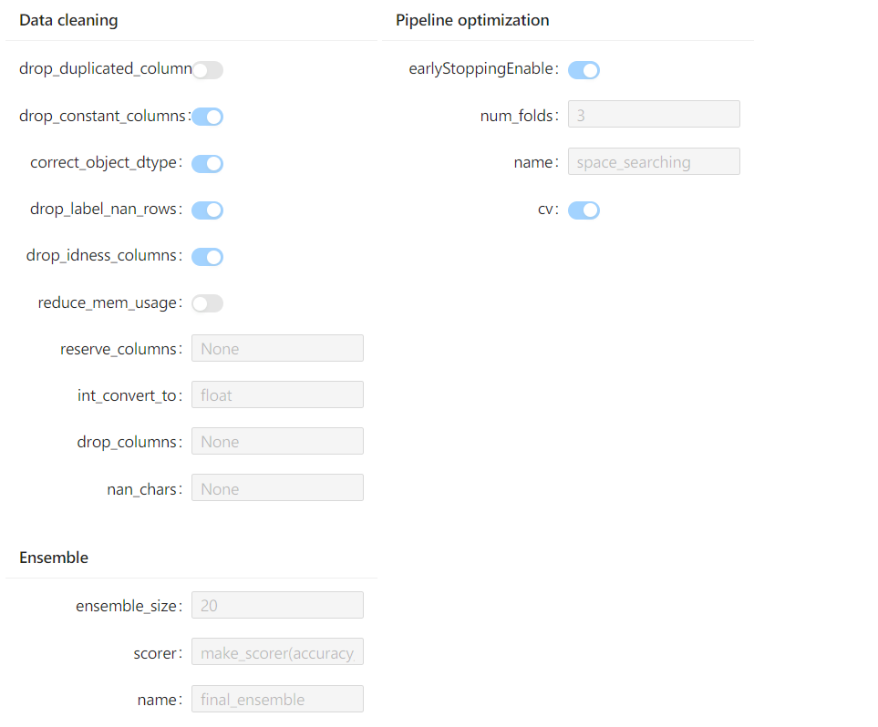

# HyperGBM: Experiment Visualization in Notebook

This section demonstrates how to visualize a HyperGBM experiment in [Jupyter Notebook](https://jupyter.org/). With the [visualization tool](https://github.com/DataCanvasIO/hboard/tree/main/hboard-widget), you could:  
1. check the experiment configurations
2. check the dataset information
3. check the processing information

To use these features, an additional package needs to be installed:
```
pip install hboard-widget
```

## Example

1. import the required packages
```python
import warnings
warnings.filterwarnings('ignore')

from hypernets.utils import logging

from sklearn.model_selection import train_test_split

from hypergbm import make_experiment
from hypernets.tabular.datasets import dsutils
```


2. creat an experiment

```python
df = dsutils.load_bank()

df_train, df_test = train_test_split(df, test_size=0.8, random_state=42)

experiment = make_experiment(df_train, target='y')
experiment
```
The experiment configurations is shown as below:



3. plot the dataset information

```python
experiment.plot_dataset()
```
The output information is shown below:


4. plot the processing information
```python
experiment.run(max_trials=20)
```
The output information is shown below:


Check the Notebook example [hypegbm_experiment_notebook_visualization.ipynb](../../../hypergbm/examples/72.hypegbm_experiment_notebook_visualization.ipynb)
