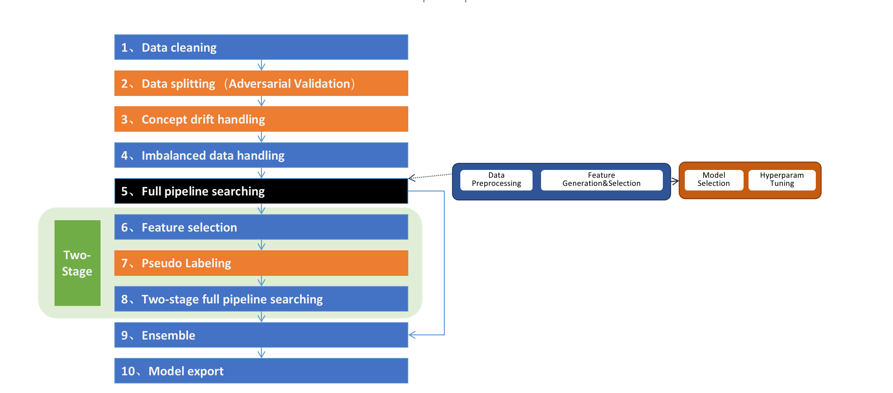

## CompeteExperiment

在结构化数据的机器学习建模过程中依然存在这诸多挑战，例如：样本不均衡、数据漂移、泛化能力不足等问题。这些问题并不同通过模型搜索来完全解决，因此我们引入了一个更高级的工具`CompeteExperiment`。

`CompeteExperiment` 由一系列的step组成，Pipeline搜索只是其中的一步。它很多高级的特性，如数据清洗、数据漂移检测和处理、二阶段搜索、自动模型融合等。

如下图所示：




**必选参数**
- *hyper_model*: hypergbm.HyperGBM, 一个`HyperGBM` 实例。
- *X_train*: Pandas or Dask DataFrame, 用于训练的特征数据
- *y_train*: Pandas or Dask Series, 用于训练的目标列


**可选参数**
- *X_eval*: (Pandas or Dask DataFrame) or None, (default=None), 用于评估的特征数据
- *y_eval*: (Pandas or Dask Series) or None, (default=None), 用于评估的目标列
- *X_test*: (Pandas or Dask Series) or None, (default=None), 用于semi-supervised learning的无法观测到目标列的特征数据
- *eval_size*: float or int, (default=None), 仅在``X_eval`` 或 ``y_eval`` 为 None时有效。 如果是float值，应该是在0.0到1.0之间的数值，代表分割到验证集中的样本比例。如果是int值，代表分割到验证集中的样本数量。
- *train_test_split_strategy*: *'adversarial_validation'* or None, (default=None), 仅在``X_eval`` 或 ``y_eval`` 为 None时有效。 如果为None使用eval_size来分割数据，如果为'adversarial_validation' 使用对抗验证的方法来分割数据集。
- *cv*: bool, (default=False), 如果为True，会使用全部训练数据的cross-validation评估结果来指导搜索方向，否则使用指定的评估集的评估结果。
- *num_folds*: int, (default=3), cross-validated的折数，仅在cv=True时有效。
- *task*: str or None, optinal(default=None), 任务类型（*'binary'*,*'multiclass'* or *'regression'*）。如果为None会自动根据目标列的值推断任务类型。
- *callbacks*: list of callback functions or None, (default=None), 用于获取实验step事件的callback函数列表， See `hypernets.experiment.ExperimentCallback` for more information.
- *random_state*: int or RandomState instance, (default=9527), 数据分割时使用的随机状态。
- *scorer*: str, callable or None, (default=None), 用于特征重要性评估和ensemble的评分器，可以是scorer的名称(see [get_scorer](https://scikit-learn.org/stable/modules/generated/sklearn.metrics.get_scorer.html))，也可以是一个可以调用的函数(see [make_scorer](https://scikit-learn.org/stable/modules/generated/sklearn.metrics.make_scorer.html))。如果为None会发生异常。
- *data_cleaner_args*: dict, (default=None), 用来初始化`DataCleaner`对象的参数字典. 如果为None将使用默认值初始化。
- *collinearity_detection*: bool, (default=False), 是否删除发生共线性的特征。
- *drift_detection*: bool,(default=True), 是否开启自动数据漂移检测和处理，只有提供了*X_test*时才生效。 数据漂移是建模过程中的一个主要挑战。当数据的分布随着时间在不断的发现变化时，模型的表现会越来越差，我们在HyperGBM中引入了对抗验证的方法专门处理数据漂移问题。这个方法会自动的检测是否发生漂移，并且找出发生漂移的特征并删除他们，以保证模型在真实数据上保持良好的状态。
- *feature_reselection*: bool, (default=True), 是否开始二阶段特征筛选和模型搜索。
- *feature_reselection_estimator_size*: int, (default=10), 用于评估特征重要性的estimator数量（在一阶段搜索中表现最好的n个模型。 仅在*two_stage_importance_selection*为True是有效。
- *feature_reselection_threshold*: float, (default=1e-5), 二阶搜索是特征选择重要性阈值，重要性低于该阈值的特征会被删除。仅在*two_stage_importance_selection*为True是有效。
- *ensemble_size*: int or None, (default=20), 用于ensemble的模型数量。ensemble_size为None或者小于1时会跳过ensemble step。 在模型搜索的过程中会产生很多模型，它们使用不同的预处理管道、不同的算法模型、不同的超参数，通常选择其中一些模型做ensemble会比只选择表现最好的单一模型获得更好的模型表现。
- *pseudo_labeling*: bool, (default=False), 是否开启伪标签学习。伪标签是一种半监督学习技术，将测试集中未观测标签列的特征数据通过一阶段训练的模型预测标签后，将置信度高于一定阈值的样本添加到训练数据中重新训练模型，有时候可以进一步提升模型在新数据上的拟合效果。
- *pseudo_labeling_proba_threshold*: float, (default=0.8), 伪标签的置信度阈值。 仅在 *two_stage_importance_selection* 为 True时有效。
- *pseudo_labeling_resplit*: bool, (default=False), 添加新的伪标签数据后是否重新分割训练集和评估集. 如果为False, 直接把所有伪标签数据添加到训练集中重新训练模型，否则把训练集、评估集及伪标签数据合并后重新分割. 仅在 *two_stage_importance_selection* 为 True时有效。
- *retrain_on_wholedata*: bool, (default=False), 在搜索完成后是否把训练集和评估集数据合并后用全量数据重新训练模型。
- *log_level*: int or None, (default=None), 搜索过程中的日志输出级别, possible values:[logging.CRITICAL, logging.FATAL, logging.ERROR, logging.WARNING, logging.WARN, logging.INFO, logging.DEBUG, logging.NOTSET]


**Code example**
```python
from hypergbm import make_experiment
from hypergbm.search_space import search_space_general
import pandas as pd
import logging

# load data into Pandas DataFrame
df = pd.read_csv('[train_data_file]')
target = 'target'

#create an experiment
experiment = make_experiment(df, target=target, 
                 search_space=lambda: search_space_general(class_balancing='SMOTE',n_estimators=300, early_stopping_rounds=10, verbose=0),
                 drop_feature_with_collinearity=False,
                 drift_detection=True,
                 two_stage_importance_selection=False,
                 n_est_feature_importance=10,
                 importance_threshold=1e-5,
                 ensemble_size=20,
                 pseudo_labeling=False,
                 pseudo_labeling_proba_threshold=0.8,
                 pseudo_labeling_resplit=False,
                 retrain_on_wholedata=False,
                 log_level=logging.ERROR,)

#run experiment
estimator = experiment.run()

# predict on real data
pred = estimator.predict(X_real)
```