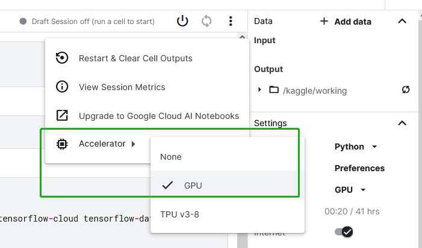

## 如何在Kaggle中通过GPU运行HyperGBM实验?


Kaggle中为每个用户提供免费的GPU资源（有时间限制），HyperGBM支持通过GPU运行实验以加速训练过程。


1. 确保您还有可用的GPU时间（GPU hours）


2. 在您的Notebook设置中启用GPU加速



3. 通过cudf加载数据并用cudf.DataFrame创建和运行HyperGBM实验

    ```
    train_data=cudf.read_xxx('...')
    experiment=make_experiment(train_data,...)
    estimator=experiment.run()
    ```

   


实际使用示例可参考 [notebook_hypergbm_bank_marketing_gpu_kaggle](https://www.kaggle.com/tele6224/notebook-hypergbm-bank-marking-gpu)：


