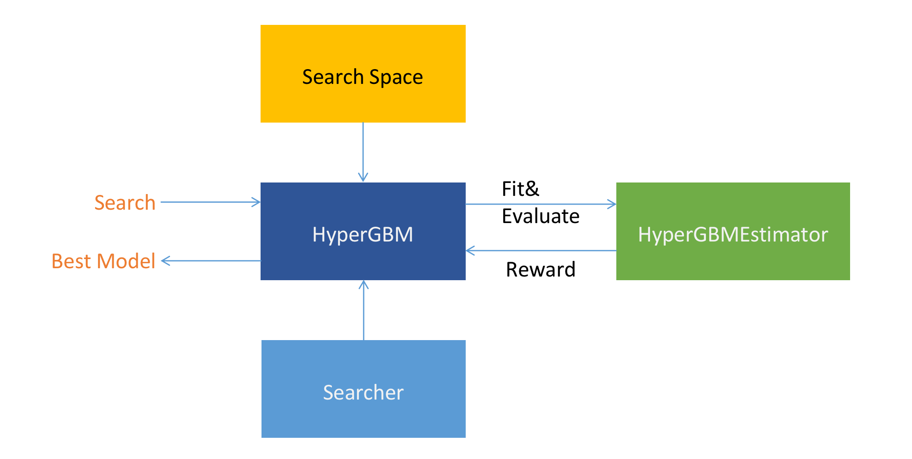
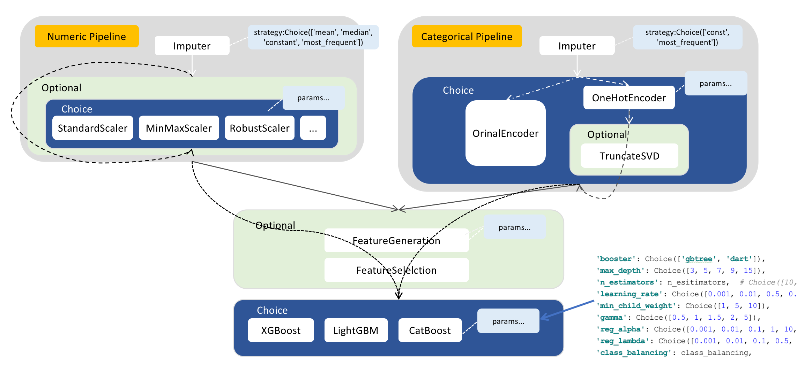

=========
概览
=========

HyperGBM是什么？
----------------

HyperGBM是一款全Pipeline自动机器学习工具，可以端到端的完整覆盖从数据清洗、预处理、特征加工和筛选以及模型选择和超参数优化的全过程，是一个真正的结构化数据AutoML工具包。

大部分的自动机器学习工具主要解决的是算法的超参数优化问题，而HyperGBM是将从数据清洗到算法优化整个的过程放入同一个搜索空间中统一优化。这种端到端的优化过程更接近于SDP(Sequential Decision Process)场景，因此HyperGBM采用了强化学习、蒙特卡洛树搜索等算法并且结合一个meta-leaner来更加高效的解决全Pipeline优化的问题，并且取得了非常出色的效果。

正如名字中的含义，HyperGBM中的机器学习算法使用了目前最流行的几种GBM算法（更准确的说是梯度提升树模型），目前包括XGBoost、LightGBM和Catboost三种。

HyperGBM中的优化算法和搜索空间表示技术由 `Hypernets <https://github.com/DataCanvasIO/Hypernets>`_  项目提供支撑。

核心组件
----------------

本节简要的介绍HyperGBM中的核心组件，如下图所示：

* HyperGBM(HyperModel)

    HyperGBM是HyperModel的一个具体实现（关于HyperModel的详细信息，请参考 `Hypernets <https://github.com/DataCanvasIO/Hypernets>`_ 。
    HyperGBM类是该项目最主要的接口，可以通过它提供的 ``search`` 方法来完成使用特定的 ``Searcher`` (搜索器)在特定 ``Search Space`` (搜索空间)中搜索并返回最佳的模型，简单来说就是一次自动建模的过程。

* Search Space（搜索空间）

    HyperGBM中的搜索空间由ModelSpace（各种Transformer和Estimator）,ConnectionSpace（Pipeline，实现Model间的连接和排列）,ParameterSpace（各种类型的超参数）三种搜索组件组合构成。Transformer使用Pipeline按顺序链接起来，Pipeline可以嵌套，这样可以实现非常复杂的多层次数据处理管道，整个搜索空间的最后一个节点只能是Estimator对象。所有的Transformer和Estimator都可以包含一组超参数搜索空间。
    下图是一个搜索空间的示例：

其中Numeric Pipeline的代码示例入下：

.. code:: python

    import numpy as np
    from hypergbm.pipeline import Pipeline
    from hypergbm.sklearn.transformers import SimpleImputer, StandardScaler, MinMaxScaler, MaxAbsScaler, RobustScaler, LogStandardScaler
    from hypernets.core.ops import ModuleChoice, Optional, Choice
    from tabular_toolbox.column_selector import  column_number_exclude_timedelta

    def numeric_pipeline_complex(impute_strategy=None, seq_no=0):
        if impute_strategy is None:
            impute_strategy = Choice(['mean', 'median', 'constant', 'most_frequent'])
        elif isinstance(impute_strategy, list):
            impute_strategy = Choice(impute_strategy)

        imputer = SimpleImputer(missing_values=np.nan, strategy=impute_strategy, name=f'numeric_imputer_{seq_no}',
                                force_output_as_float=True)
        scaler_options = ModuleChoice(
            [
                LogStandardScaler(name=f'numeric_log_standard_scaler_{seq_no}'),
                StandardScaler(name=f'numeric_standard_scaler_{seq_no}'),
                MinMaxScaler(name=f'numeric_minmax_scaler_{seq_no}'),
                MaxAbsScaler(name=f'numeric_maxabs_scaler_{seq_no}'),
                RobustScaler(name=f'numeric_robust_scaler_{seq_no}')
            ], name=f'numeric_or_scaler_{seq_no}'
        )
        scaler_optional = Optional(scaler_options, keep_link=True, name=f'numeric_scaler_optional_{seq_no}')
        pipeline = Pipeline([imputer, scaler_optional],
                            name=f'numeric_pipeline_complex_{seq_no}',
                            columns=column_number_exclude_timedelta)
        return pipeline

* Searcher

    Searcher是用于在搜索空间中完成搜索过程的算法。一个搜索算法最核心的部分就是如何平衡exploration（勘探）和exploitation（开采）的策略，一方面要能够快速的逼近全局最优解，另一方面要避免陷入局部某个次优的局部空间。
    在HyperGBM中提供了MCTSSearcher（蒙特卡洛树搜索）、EvolutionarySearcher（进化搜索）和RandomSearcher（随机搜索）三种算法。
    
* HyperGBMEstimator

    HyperGBMEstimator是根据搜索空间中的一个样本来构建的评估器对象，其中包括完整的预处理器管道（Preprocessing Pipeline）和 一个特定的GBM算法模型，可以用来在训练集上 ``fit`` ，用评估集来 ``evaluate`` 以及在新数据上完成 ``predict`` 。

* CompeteExperiment

    ``CompeteExperiment`` 是HyperGBM提供的一个强大的工具，它不但可以完成pipeline搜索，同时还包括了一系列高级特性来进一步提升模型的性能，包括data drift handling（数据漂移处理）、pseudo-labeling（伪标签-半监督学习）、ensemble等等。

特性矩阵
---------------------

其中HyperGBM有3中运行模式，分别为：

- 单机模式
- 单机分布式
- 多机分布式

三种模式对与功能特性的执行情况如下表:

+------------------------------+------------------------------------------------------------+------------------------------+------------------------------+------------------------------+
|#                             |特征                                                        |单机模式                      |单机分布式模式                |多机分布式                    |
+==============================+============================================================+==============================+==============================+==============================+
| | 特征工程                   | | 特征衍生                                                 | | √                          | |                            | |                            |
| |                            | | 特征降维                                                 | | √                          | | √                          | | √                          |
+------------------------------+------------------------------------------------------------+------------------------------+------------------------------+------------------------------+
| | 数据清洗                   | | 特殊空值字符处理                                         | | √                          | | √                          | | √                          |
| |                            | | 列类型校正                                               | | √                          | | √                          | | √                          |
| |                            | | 常量列清理                                               | | √                          | | √                          | | √                          |
| |                            | | 重复列清理                                               | | √                          | | √                          | | √                          |
| |                            | | 删除标签列为空的样本                                     | | √                          | | √                          | | √                          |
| |                            | | 非法值替换                                               | | √                          | | √                          | | √                          |
| |                            | | id列清理                                                 | | √                          | | √                          | | √                          |
| |                            | | 共线性特征清理                                           | | √                          | | √                          | | √                          |
+------------------------------+------------------------------------------------------------+------------------------------+------------------------------+------------------------------+
| | 数据集拆分                 | | 对抗验证                                                 | | √                          | | √                          | | √                          |
+------------------------------+------------------------------------------------------------+------------------------------+------------------------------+------------------------------+
| | 建模算法                   | | XGBoost                                                  | | √                          | | √                          | | √                          |
| |                            | | Catboost                                                 | | √                          | | √                          | |                            |
| |                            | | LightGBM                                                 | | √                          | | √                          | |                            |
| |                            | | HistGridientBoosting                                     | | √                          | |                            | |                            |
+------------------------------+------------------------------------------------------------+------------------------------+------------------------------+------------------------------+
| | 模型训练                   | | 自动任务类型推断                                         | | √                          | | √                          | | √                          |
| |                            | | 命令行工具                                               | | √                          | |                            | |                            |
+------------------------------+------------------------------------------------------------+------------------------------+------------------------------+------------------------------+
| | 评估方法                   | | 交叉验证(Cross-Validation)                               | | √                          | | √                          | | √                          |
| |                            | | Train-Validation-Holdout验证                             | | √                          | | √                          | | √                          |
+------------------------------+------------------------------------------------------------+------------------------------+------------------------------+------------------------------+
| | 搜索算法                   | | 蒙特卡洛树算法                                           | | √                          | | √                          | | √                          |
| |                            | | 进化算法                                                 | | √                          | | √                          | | √                          |
| |                            | | 随机搜索                                                 | | √                          | | √                          | | √                          |
+------------------------------+------------------------------------------------------------+------------------------------+------------------------------+------------------------------+
| | 类平衡                     | | Class Weight                                             | | √                          | | √                          | | √                          |
| |                            | | 降采样(Near miss,Tomeks links,Random)                    | | √                          | |                            | |                            |
| |                            | | 过采样(SMOTE,ADASYN,Random)                              | | √                          | |                            | |                            |
+------------------------------+------------------------------------------------------------+------------------------------+------------------------------+------------------------------+
| | 提前停止策略               | | n次搜索都不再提升,提前停止                               | | √                          | | √                          | | √                          |
| |                            | | 最大用时间提前停止                                       | | √                          | | √                          | | √                          |
| |                            | | expected_reward                                          | | √                          | | √                          | | √                          |
+------------------------------+------------------------------------------------------------+------------------------------+------------------------------+------------------------------+
| | 高级特性                   | | 二阶段搜索(伪标签,特征选择)                              | | √                          | | √                          | | √                          |
| |                            | | 概念漂移处理                                             | | √                          | | √                          | | √                          |
| |                            | | 模型融合                                                 | | √                          | | √                          | | √                          |
+------------------------------+------------------------------------------------------------+------------------------------+------------------------------+------------------------------+
