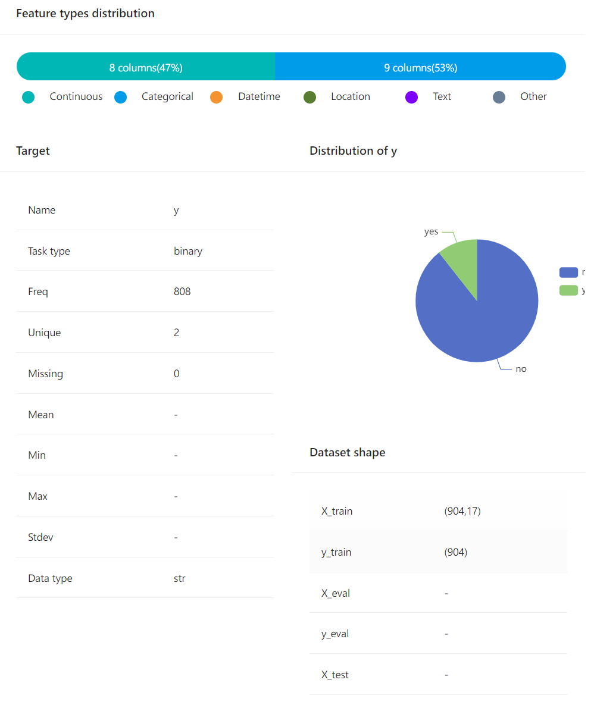
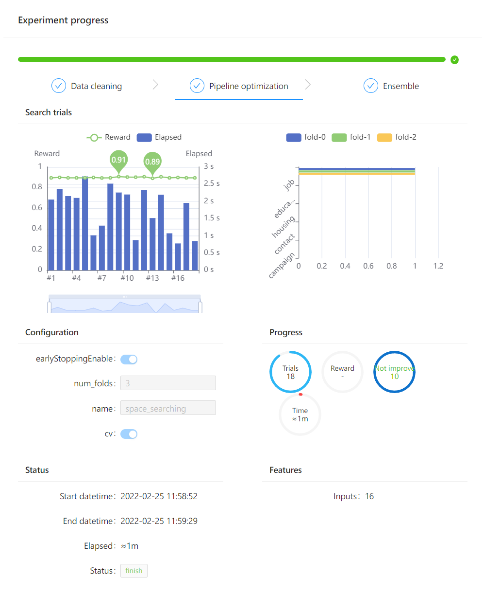

# 通过Notebook使用HyperGBM

HyperGBM与[experiment-visualization](https://github.com/DataCanvasIO/HyperBoard/tree/main/experiment-visualization) 整合使您在notebook使用使用HyperGBM时可以：
1. 查看实验配置信息
2. 查看实验数据集信息
3. 查看实验运行信息

注意，这些特性依赖`experiment-visualization`并且是可选的，如果要使用请确认您已经安装过了notebook相关依赖，如果没有您可以通过以下命令补充安装：

```
pip install experiment-notebook-widget
```

## 可视化HyperGBM的实验

这是一个例子是关于如何在[Jupyter Notebook](https://jupyter.org/) 使用HyperGBM实验可视化。
1. 导入模块
```python
import warnings
warnings.filterwarnings('ignore')

from hypernets.utils import logging

from sklearn.model_selection import train_test_split

from hypergbm import make_experiment
from hypernets.tabular.datasets import dsutils
```


2. 构建实验并可视化实验配置

```python
df = dsutils.load_bank()

df_train, df_test = train_test_split(df, test_size=0.8, random_state=42)

experiment = make_experiment(df_train, target='y')
experiment
```


3. 可视化实验数据集信息

```python
experiment.plot_dataset()
```



4. 可视化实验运行信息
```python
experiment.run(max_trials=20)
```



这个Notebook的例子在[72.hypegbm_experiment_notebook_visualization.ipynb](../../../hypergbm/examples/72.hypegbm_experiment_notebook_visualization.ipynb)
